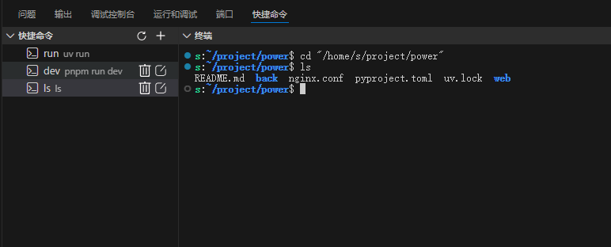

# Run Commands in Terminal

[](https://marketplace.visualstudio.com/) 
[](https://github.com/xing-shuyin/run_in_terminal)

🚀 **快速在 VS Code 终端中执行常用命令的扩展**，支持自定义命令管理、一键执行和多项目管理。



## ✨ 功能特性

- 🎯 **一键执行** - 在活动栏快速访问和执行命令
- ⚙️ **自定义命令** - 轻松添加、编辑、删除常用命令
- 📁 **多工作目录** - 支持不同项目的独立命令配置
- 🖥️ **终端集成** - 可将图标拖拽到终端标题栏，美观便捷
- 🔧 **变量支持** - 支持 `${workspaceFolder}` 和环境变量展开
- 🎨 **直观界面** - 树形视图清晰展示所有命令

## 📦 安装

### 从 VS Code 市场安装
1. 打开 VS Code
2. 进入扩展面板 (`Ctrl+Shift+X`)
3. 搜索 "Run Commands in Terminal"
4. 点击安装

### 手动安装
1. 下载最新版本的 `.vsix` 文件
2. 在 VS Code 中按 `Ctrl+Shift+P`
3. 输入 "Extensions: Install from VSIX"
4. 选择下载的文件进行安装

## 🚀 快速开始

### 1. 配置文件结构

在项目根目录的 `.vscode/commands.json` 中配置你的命令：
```json
{
  "commands": [
    {
      "id": "1",
      "name": "Backend Run",
      "command": "uv run main.py",
      "workingDirectory": "${workspaceFolder}/back",
      "description": "运行后端服务"
    },
    {
      "id": "2", 
      "name": "Frontend Dev",
      "command": "pnpm run dev",
      "workingDirectory": "${workspaceFolder}/web",
      "description": "启动前端开发服务器"
    },
    {
      "id": "3",
      "name": "List Files",
      "command": "ls -la",
      "workingDirectory": "${workspaceFolder}",
      "description": "列出项目根目录文件"
    }
  ]
}
```

### 2. 配置说明

| 字段 | 类型 | 必需 | 说明 |
|------|------|------|------|
| `id` | string | ✅ | 命令唯一标识符 |
| `name` | string | ✅ | 命令显示名称 |
| `command` | string | ✅ | 要执行的 shell 命令 |
| `workingDirectory` | string | ❌ | 工作目录（支持变量） |
| `description` | string | ❌ | 命令描述信息 |

### 3. 支持的变量

- `${workspaceFolder}` - 当前工作区根目录
- `~` - 用户主目录
- `$ENV_VAR` - 环境变量

## ⚠️ 重要配置

### 禁用 Python 环境自动激活

为避免中断 FastAPI 等服务运行，请在 VS Code 设置中添加：
```json
{
  "python.terminal.activateEnvironment": false
}
```

**设置方法：**
1. 按 `Ctrl+,` 打开设置
2. 搜索 `python.terminal.activateEnvironment`
3. 取消勾选或设置为 `false`

### 终端图标集成

1. 在活动栏找到插件图标
2. 将其拖拽到终端标题栏
3. 享受美观的命令执行界面

## 📖 使用指南

### 基本操作

1. **查看命令列表**
   - 点击活动栏的插件图标
   - 树形视图显示所有配置的命令

2. **执行命令**
   - 直接点击命令项
   - 或右键选择"执行命令"

3. **添加新命令**
   - 右键空白处选择"添加命令"
   - 或点击右上角的添加按钮
   - 按提示填写命令信息

4. **编辑命令**
   - 右键命令项选择"编辑命令"
   - 修改后保存即可

5. **删除命令**
   - 右键命令项选择"删除命令"
   - 确认删除操作


## 🤝 贡献指南

欢迎提交 Issue 和 Pull Request！

1. Fork 本项目
2. 创建特性分支 (`git checkout -b feature/AmazingFeature`)
3. 提交更改 (`git commit -m 'Add some AmazingFeature'`)
4. 推送到分支 (`git push origin feature/AmazingFeature`)
5. 开启 Pull Request

## 📄 许可证

本项目基于 MIT 许可证开源 - 查看 [LICENSE](LICENSE) 文件了解详情。

## 🙏 致谢

感谢所有为本项目做出贡献的开发者！

---

**GitHub**: https://github.com/xing-shuyin/run_in_terminal

**反馈问题**: [Issues](https://github.com/xing-shuyin/run_in_terminal/issues)
